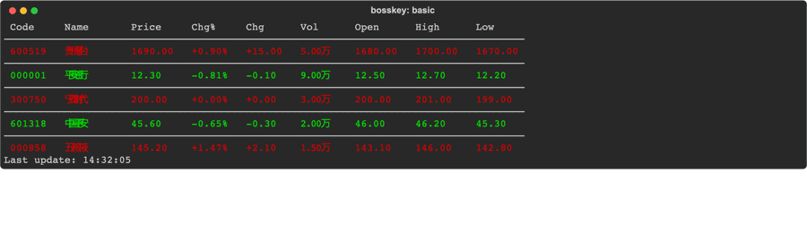
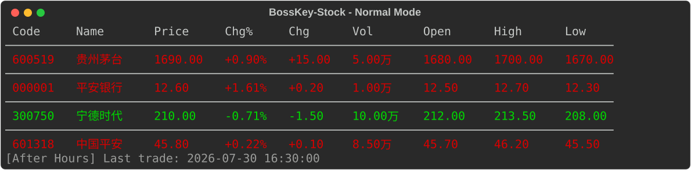
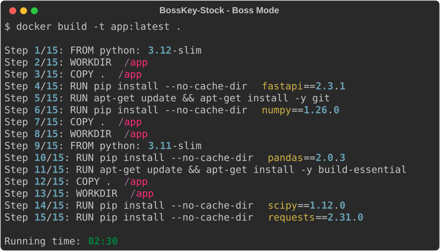

<p align="center">
  
  
  
</p>

<h1 align="center">BossKey-Stock — 终端摸鱼盯盘工具</h1>

<p align="center">
  <b>A</b>股 · 在终端里偷看行情 · 按一下 <code>b</code> 秒变 Docker 编译日志
</p>

<p align="center">
  <code>pip install bosskey-stock</code> &nbsp;|&nbsp; <code>bosskey</code>
</p>

---

**BossKey-Stock** 是一个纯终端 A 股实时行情监控工具。不需要打开浏览器、不需要切窗口、不需要 API Key。`bosskey` 回车，你的终端就变成了红绿相间的行情看板；听到脚步声，按 `b` 键，它又变成了一个正经的 Docker 构建日志。

> 🐟 **这个项目为什么存在？**  
> 作为一名程序员，我一天 8+ 小时在终端里。行情软件切来切去不仅麻烦，而且屏幕上一片红绿实在过于醒目。  
> 我需要一个东西——安安静静地待在终端里，别人路过时看起来像是在认真看 build log，但实际上……它在盯盘。  
> 这个就是 BossKey — 老板键，专门为摸鱼而生。

## 截图

<p align="center">
  
</p>

*行情刷新时的实时变化，按 `b` 键一键切换老板模式*



*正常模式 — 红涨绿跌的行情看板*



*老板模式 — 按 `b` 后秒变 Docker build 日志*

## 功能

| 功能 | 说明 |
|------|------|
| 📊 **实时行情** | Rich 表格渲染，红涨绿跌，整行着色 |
| ⏱ **智能刷新** | 交易时段（工作日 9:30-11:30 / 13:00-15:00）自动刷新，非交易时段停刷 |
| 🕶 **老板模式** | 按 `b` 一键切换 Docker build 伪日志，再按 `b` 切回 |
| ⌨️ **零依赖终端控制** | 单线程，一次 `tcsetattr`，无后台线程 |
| ⚡ **键盘操作** | `r` 手动刷新，`q` / `Ctrl+C` 退出 |
| 📝 **监控列表管理** | CLI 子命令 `add` / `rm` / `list` |
| 🌐 **离线检测** | 网络断开时黄色 `[Offline]` 提示，续网自动恢复 |

## 安装

### 从 PyPI（推荐）

```bash
pip install bosskey-stock
```

### 从源码

```bash
git clone https://github.com/shark/bosskey-stock.git
cd bosskey-stock
pip install -e .
```

安装后使用 `bosskey` 命令。

## 快速开始

```bash
# 启动盯盘
bosskey

# 添加股票到监控列表
bosskey add 601318 000858

# 移除股票
bosskey rm 000001

# 查看当前监控列表
bosskey list
```

### 终端内操作

| 按键 | 功能 |
|------|------|
| `b` | 老板模式切换（行情 ↔ Docker 日志） |
| `r` | 手动刷新行情 |
| `q` / `Ctrl+C` | 退出（终端完全恢复，无 traceback） |

## 配置

配置文件 `~/.bosskey.toml` 在首次运行时自动创建：

```toml
[display]
refresh_interval = 3

[watchlist]
codes = ["000001", "600519", "300750"]
```

## 数据来源

本项目使用 **[Sina Finance 实时行情 API](https://hq.sinajs.cn/)**，这是一个免费、无需 API Key 的公开接口。

> ⚠️ **免责声明**  
> Sina Finance API 是非官方的公开接口，无正式服务等级承诺。数据仅作个人参考，不构成投资建议。  
> 如新浪调整接口策略导致工具不可用，请提交 Issue，我们会跟进适配。

## 与同类工具对比

| | BossKey-Stock | 同花顺/东方财富 | tushare | 
|--|---------------|----------------|---------|
| 终端运行 | ✅ | ❌ | ✅ |
| 老板模式 | ✅ | ❌ | ❌ |
| 需 API Key | ❌ | ❌ | ✅ |
| 需注册 | ❌ | ✅ | ✅ |
| 安装大小 | 3 个依赖 | 几百 MB | 中等 |

## 项目结构

```
bosskey-stock/
├── bosskey_stock/
│   ├── __init__.py        # 包标记
│   ├── __main__.py        # CLI 入口，子命令路由
│   ├── app.py             # 主循环：Rich Live + 非阻塞键盘输入
│   ├── data.py            # Sina 数据层，GBK 编码解析
│   ├── boss.py            # 老板模式（Docker build 伪日志）
│   └── config.py          # 配置读写
├── tests/
│   ├── test_data.py       # 数据解析测试
│   ├── test_config.py     # 配置管理测试
│   └── test_boss.py       # 老板模式测试
├── docs/
│   └── design.md          # 架构设计文档
├── pyproject.toml          # 打包与项目配置
├── LICENSE
├── README.md
└── CHANGELOG.md
```

## 为什么是 Python？

这是有意为之的。典型办公环境预装 Python，`pip install bosskey-stock` 就能用——不需要申请安装权限、不需要 IT 审批、不需要管理员权限。  
一个纯文本的工具，在任何 SSH 会话、tmux 窗口、甚至远程服务器上都能跑。

## 贡献

见 [CONTRIBUTING.md](CONTRIBUTING.md)。

## License

[MIT License](LICENSE)
